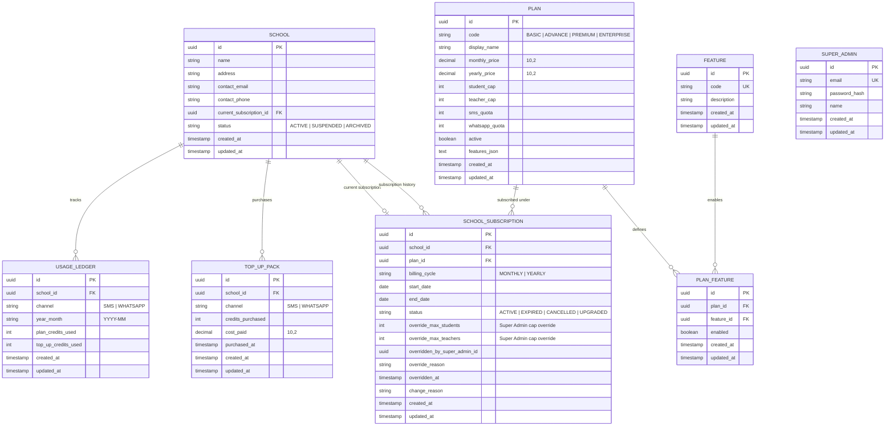
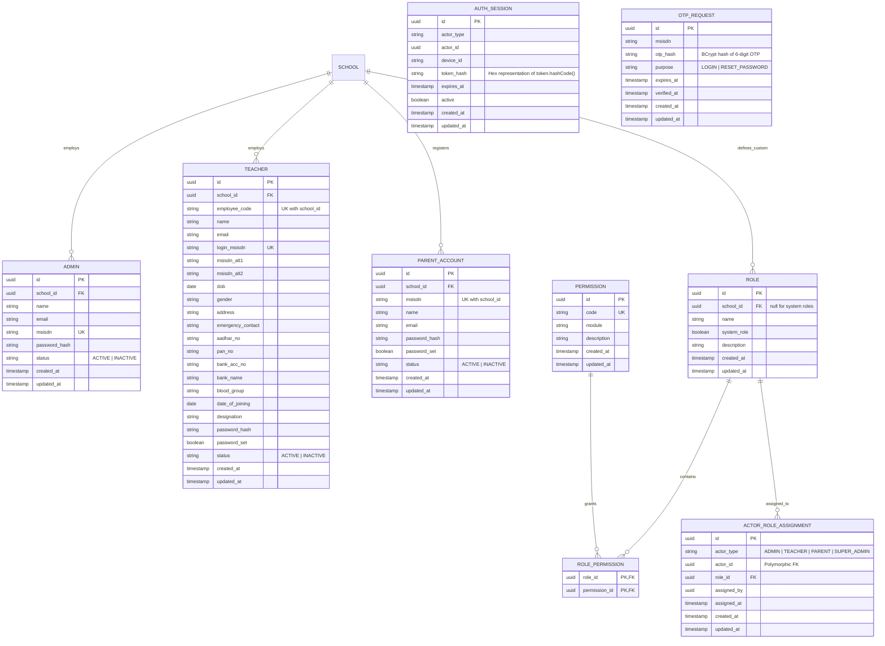
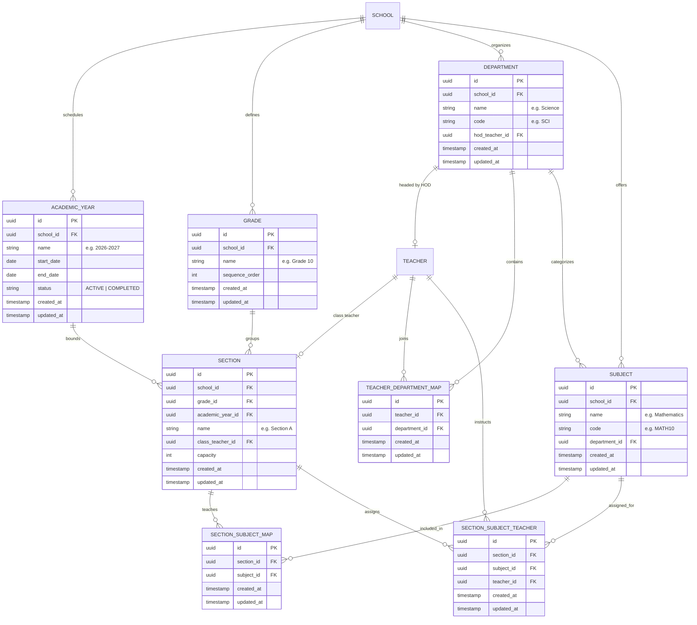
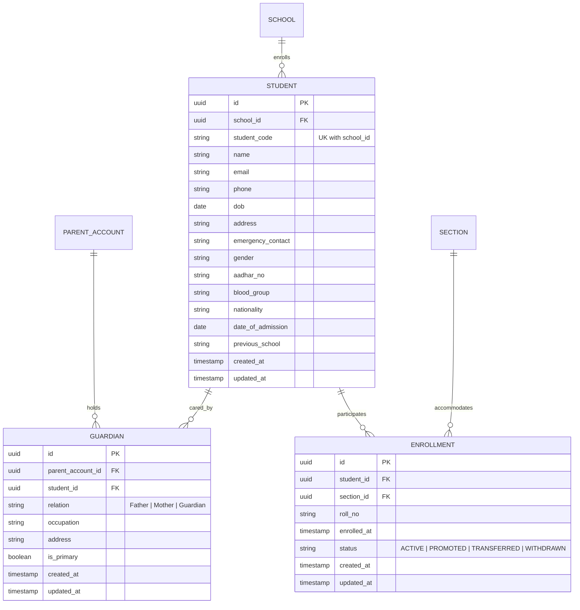
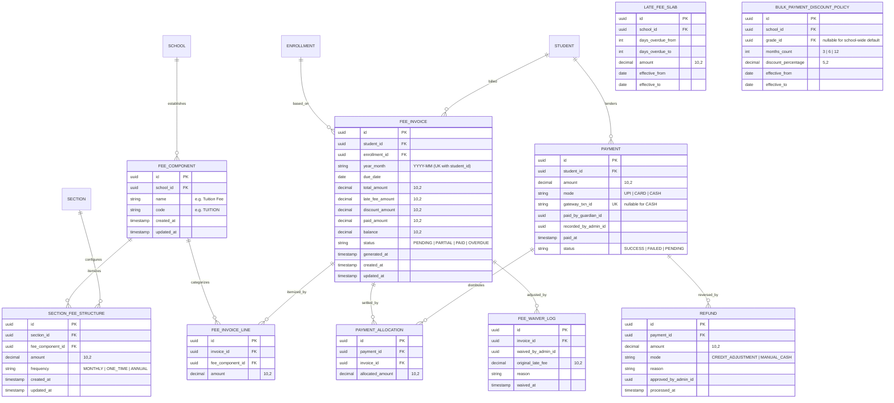
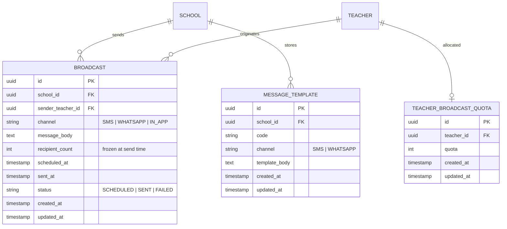
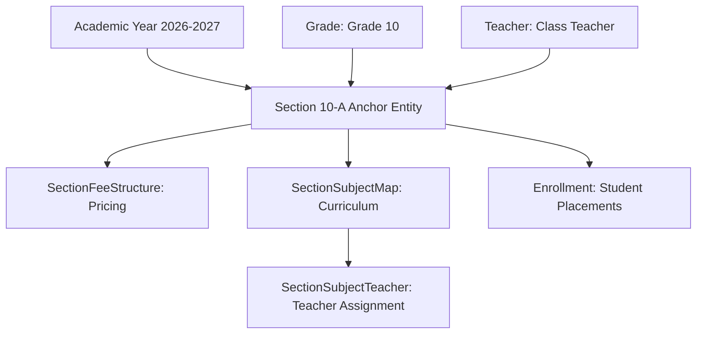
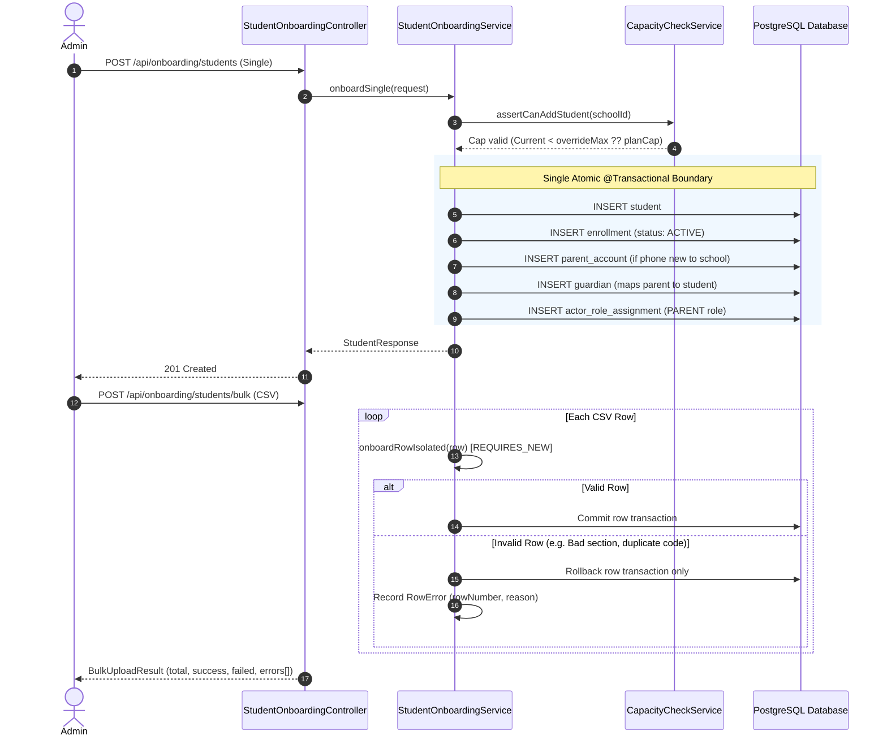
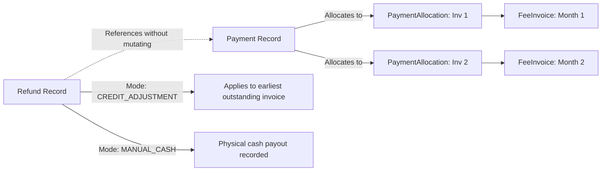

# School ERP — Low Level Design (LLD) Document
**System Architecture, Entity-Relationship Modeling & Database Specifications**

---

## 1. Executive Architecture & Design Principles

### 1.1 Multi-Tenant Isolation
- **Pattern**: Shared database with discriminator column (`school_id`).
- **Enforcement**: Hibernate ORM-level `@Filter(name = "tenantFilter", condition = "school_id = :schoolId")` parameterized per-request by `TenantFilterInterceptor`.
- **Super-Admin Bypass**: Super-Admin or public unauthenticated requests operate with `school_id = null`, disabling the filter for cross-tenant platform administration.

### 1.2 Primary Key & Financial Data Standards
- **Primary Keys**: Time-sequential UUIDs (`@UuidGenerator(style = UuidGenerator.Style.TIME)` on `BaseEntity`).
- **Monetary Fields**: Strict high-precision `DECIMAL(10,2)` across all financial ledgers, fee structures, invoices, and payment allocations.
- **Append-Only Policies**: `LateFeeSlab`, `BulkPaymentDiscountPolicy`, and `FeeWaiverLog` are never modified in-place; historical terms are sealed with `effective_to` and new slabs are inserted with `effective_from`.

### 1.3 Authorization Architecture
- **Layer 1 (Authentication)**: `JwtAuthFilter` extracts JWT claims (`actorType`, `actorId`, `schoolId`, `planCode`, `features`).
- **Layer 2 (Tenant Context)**: `TenantFilterInterceptor` activates Hibernate `tenantFilter`.
- **Layer 3 (RBAC Gateway)**: `SchoolErpPermissionEvaluator` evaluates SpEL `@PreAuthorize("hasPermission(null, 'CODE')")` against `PermissionService` (cached).
- **Layer 4 (Domain Rules)**: Service-level ownership validation (e.g., verifying teachers and sections belong to caller's school).

---

## 2. Master Unified Database Entity-Relationship Diagram

> **Visual Artifacts**:
> - **Interactive Browser Viewer (Zoom / Pan / Domain Filters)**: Open [school-erp-lld-diagram.html](file:///Users/shubhamverma/Workspace%20Active%20Projects/school_erp/school-erp-lld-diagram.html) in your browser.
> - **Standalone Vector Graphic**: View [school-erp-lld-diagram.svg](file:///Users/shubhamverma/Workspace%20Active%20Projects/school_erp/school-erp-lld-diagram.svg).

```mermaid
erDiagram
    %% Tenancy & Subscription
    SCHOOL ||--o| SCHOOL_SUBSCRIPTION : "current subscription"
    SCHOOL ||--o{ SCHOOL_SUBSCRIPTION : "subscription history"
    PLAN ||--o{ SCHOOL_SUBSCRIPTION : "subscribed under"
    PLAN ||--o{ PLAN_FEATURE : defines
    FEATURE ||--o{ PLAN_FEATURE : enables
    SCHOOL ||--o{ TOP_UP_PACK : purchases
    SCHOOL ||--o{ USAGE_LEDGER : tracks

    %% Identity & RBAC
    SCHOOL ||--o{ ADMIN : employs
    SCHOOL ||--o{ TEACHER : employs
    SCHOOL ||--o{ PARENT_ACCOUNT : registers
    SCHOOL ||--o{ ROLE : defines_custom
    ROLE ||--o{ ROLE_PERMISSION : contains
    PERMISSION ||--o{ ROLE_PERMISSION : grants
    ROLE ||--o{ ACTOR_ROLE_ASSIGNMENT : assigned_in

    %% Academic Setup (Anchor: Section)
    SCHOOL ||--o{ ACADEMIC_YEAR : schedules
    SCHOOL ||--o{ GRADE : defines
    SCHOOL ||--o{ DEPARTMENT : organizes
    SCHOOL ||--o{ SUBJECT : offers
    GRADE ||--o{ SECTION : groups
    ACADEMIC_YEAR ||--o{ SECTION : bounds
    TEACHER ||--o| SECTION : "class teacher"
    DEPARTMENT ||--o| TEACHER : "headed by HOD"
    TEACHER ||--o{ TEACHER_DEPARTMENT_MAP : belongs_to
    DEPARTMENT ||--o{ TEACHER_DEPARTMENT_MAP : has_teacher
    SECTION ||--o{ SECTION_SUBJECT_MAP : teaches
    SUBJECT ||--o{ SECTION_SUBJECT_MAP : included_in
    SECTION ||--o{ SECTION_SUBJECT_TEACHER : assigns
    SUBJECT ||--o{ SECTION_SUBJECT_TEACHER : for_subject
    TEACHER ||--o{ SECTION_SUBJECT_TEACHER : instructs

    %% Student Placement & Guardians
    SCHOOL ||--o{ STUDENT : enrolls
    PARENT_ACCOUNT ||--o{ GUARDIAN : holds
    STUDENT ||--o{ GUARDIAN : cared_by
    STUDENT ||--o{ ENROLLMENT : participates
    SECTION ||--o{ ENROLLMENT : accommodates

    %% Fee Management & Payments
    SCHOOL ||--o{ FEE_COMPONENT : establishes
    SECTION ||--o{ SECTION_FEE_STRUCTURE : prices
    FEE_COMPONENT ||--o{ SECTION_FEE_STRUCTURE : itemizes
    STUDENT ||--o{ FEE_INVOICE : billed
    ENROLLMENT ||--o{ FEE_INVOICE : based_on
    FEE_INVOICE ||--o{ FEE_INVOICE_LINE : itemized_by
    FEE_COMPONENT ||--o{ FEE_INVOICE_LINE : categorizes
    STUDENT ||--o{ PAYMENT : tenders
    PAYMENT ||--o{ PAYMENT_ALLOCATION : distributes
    FEE_INVOICE ||--o{ PAYMENT_ALLOCATION : settled_by
    FEE_INVOICE ||--o{ FEE_WAIVER_LOG : adjusted_by
    PAYMENT ||--o{ REFUND : reversed_by

    %% Communication
    SCHOOL ||--o{ BROADCAST : dispatches
    TEACHER ||--o{ BROADCAST : originates
    TEACHER ||--o| TEACHER_BROADCAST_QUOTA : allocated
    SCHOOL ||--o{ MESSAGE_TEMPLATE : stores

    %% Key Definitions
    SCHOOL {
        uuid id PK
        string name
        uuid current_subscription_id FK
        string status
    }
    PLAN {
        uuid id PK
        string code UK
        decimal monthly_price
        int student_cap
    }
    SCHOOL_SUBSCRIPTION {
        uuid id PK
        uuid school_id FK
        uuid plan_id FK
        string status
    }
    ADMIN {
        uuid id PK
        uuid school_id FK
        string msisdn UK
    }
    TEACHER {
        uuid id PK
        uuid school_id FK
        string employee_code UK
        string login_msisdn UK
    }
    PARENT_ACCOUNT {
        uuid id PK
        uuid school_id FK
        string msisdn UK
    }
    GRADE {
        uuid id PK
        uuid school_id FK
        string name
    }
    SECTION {
        uuid id PK
        uuid school_id FK
        uuid grade_id FK
        uuid academic_year_id FK
        uuid class_teacher_id FK
        string name
    }
    STUDENT {
        uuid id PK
        uuid school_id FK
        string student_code UK
        string name
    }
    ENROLLMENT {
        uuid id PK
        uuid student_id FK
        uuid section_id FK
        string status
    }
    GUARDIAN {
        uuid id PK
        uuid parent_account_id FK
        uuid student_id FK
        string relation
    }
    FEE_INVOICE {
        uuid id PK
        uuid student_id FK
        uuid enrollment_id FK
        string year_month UK
        decimal total_amount
        decimal balance
        string status
    }
    PAYMENT {
        uuid id PK
        uuid student_id FK
        decimal amount
        string mode
        string gateway_txn_id UK
    }
    PAYMENT_ALLOCATION {
        uuid id PK
        uuid payment_id FK
        uuid invoice_id FK
        decimal allocated_amount
    }
```




---

## 3. Module-by-Module Entity Relationships & Schemas

### 3.1 Tenancy & Billing Domain
Manages schools, subscription tiers, platform feature gating, and top-up quota ledgers.



---

### 3.2 Identity & Role-Based Access Control (RBAC) Domain
Manages identities (Admin, Teacher, Parent), system & custom roles, polymorphic role assignments, and token sessions.



---

### 3.3 Academic Setup Domain
The core structural skeleton of classes, sections, departments, subjects, and teaching allocations.

> **Key Architectural Pattern: The Anchor Entity**
> `Section` is the foundational anchor entity. It is recreated per academic year. All fee structures, student enrollments, subject curriculum maps, and class teacher allocations attach to `Section` rather than `Grade` or `Student`.



---

### 3.4 Student Management & Onboarding Domain
Separates permanent student identity from year-scoped classroom enrollment, mapped with guardian accounts.



> **Key Database Constraint: Single Active Enrollment**
> To prevent duplicate active school placements:
> ```sql
> CREATE UNIQUE INDEX ux_enrollment_one_active ON enrollment(student_id) WHERE status = 'ACTIVE';
> ```

---

### 3.5 Fee Management, Billing & Payment Allocation Domain
End-to-end fee lifecycle handling recurring invoices, effective-dated penalties & discounts, payments, allocations, waivers, and non-destructive refunds.



---

### 3.6 Communication Hub Domain
Notification records, messaging quota management, and message templates.



---

## 4. Complete Database Table Dictionary

| Table Name | Primary Key | Foreign Keys / Scoping | Indexes & Unique Constraints | Core Responsibility |
| :--- | :--- | :--- | :--- | :--- |
| `school` | `id` (UUID) | `current_subscription_id` -> `school_subscription(id)` | PK index | Root tenant entity. |
| `plan` | `id` (UUID) | None | `code` UNIQUE | Subscription tier catalog. |
| `feature` | `id` (UUID) | None | `code` UNIQUE | Granular feature items for plans. |
| `plan_feature` | `id` (UUID) | `plan_id` -> `plan(id)`, `feature_id` -> `feature(id)` | UNIQUE(`plan_id`, `feature_id`) | Feature gating per plan. |
| `school_subscription` | `id` (UUID) | `school_id` -> `school(id)`, `plan_id` -> `plan(id)` | Index(`school_id`, `status`) | Active & historic subscription log. |
| `top_up_pack` | `id` (UUID) | `school_id` -> `school(id)` | Index(`school_id`, `channel`) | SMS/WhatsApp credit packages. |
| `usage_ledger` | `id` (UUID) | `school_id` -> `school(id)` | UNIQUE(`school_id`, `channel`, `year_month`) | Monthly credit usage tracking. |
| `super_admin` | `id` (UUID) | None | `email` UNIQUE | Platform owner credentials. |
| `admin` | `id` (UUID) | `school_id` -> `school(id)` | `msisdn` UNIQUE | School administrator account. |
| `teacher` | `id` (UUID) | `school_id` -> `school(id)` | `login_msisdn` UNIQUE, UNIQUE(`school_id`, `employee_code`) | Teaching staff account. |
| `parent_account` | `id` (UUID) | `school_id` -> `school(id)` | UNIQUE(`school_id`, `msisdn`) | Guardian account scoped to school. |
| `guardian` | `id` (UUID) | `parent_account_id` -> `parent_account(id)`, `student_id` -> `student(id)` | Index(`parent_account_id`), Index(`student_id`) | Parent-Student association. |
| `auth_session` | `id` (UUID) | Polymorphic `(actor_type, actor_id)` | Index(`actor_type`, `actor_id`, `active`) | Enforces single active session per actor. |
| `otp_request` | `id` (UUID) | None | Index(`msisdn`, `verified_at`) | OTP lifecycle and verification log. |
| `role` | `id` (UUID) | `school_id` -> `school(id)` (`null` for system) | UNIQUE(`school_id`, `name`) | System & custom RBAC roles. |
| `permission` | `id` (UUID) | None | `code` UNIQUE | Fine-grained capability definitions. |
| `role_permission` | `(role_id, permission_id)` | FKs to `role(id)` & `permission(id)` | Compound PK | Maps capabilities to roles. |
| `actor_role_assignment`| `id` (UUID) | Polymorphic `(actor_type, actor_id)`, `role_id` -> `role(id)`| Index(`actor_type`, `actor_id`) | Assigns roles to polymorphic actors. |
| `academic_year` | `id` (UUID) | `school_id` -> `school(id)` | Index(`school_id`, `status`) | School operational session. |
| `grade` | `id` (UUID) | `school_id` -> `school(id)` | Index(`school_id`, `sequence_order`) | Year-independent grade labels. |
| `department` | `id` (UUID) | `school_id` -> `school(id)`, `hod_teacher_id` -> `teacher(id)` | UNIQUE(`school_id`, `code`) | Academic departments. |
| `teacher_department_map`| `id` (UUID) | `teacher_id` -> `teacher(id)`, `department_id` -> `department(id)` | UNIQUE(`teacher_id`, `department_id`) | Teacher department associations. |
| `section` | `id` (UUID) | `school_id`, `grade_id`, `academic_year_id`, `class_teacher_id` | UNIQUE(`grade_id`, `academic_year_id`, `name`) | **Anchor Entity** for classes. |
| `subject` | `id` (UUID) | `school_id` -> `school(id)`, `department_id` -> `department(id)` | UNIQUE(`school_id`, `code`) | Subject definitions. |
| `section_subject_map` | `id` (UUID) | `section_id` -> `section(id)`, `subject_id` -> `subject(id)` | UNIQUE(`section_id`, `subject_id`) | Curriculum per section. |
| `section_subject_teacher`| `id` (UUID) | `section_id`, `subject_id`, `teacher_id` | UNIQUE(`section_id`, `subject_id`, `teacher_id`) | Subject teacher assignment. |
| `student` | `id` (UUID) | `school_id` -> `school(id)` | UNIQUE(`school_id`, `student_code`) | Permanent student identity. |
| `enrollment` | `id` (UUID) | `student_id` -> `student(id)`, `section_id` -> `section(id)` | Partial UNIQUE on `student_id` WHERE `status = 'ACTIVE'` | Year-scoped section placement. |
| `fee_component` | `id` (UUID) | `school_id` -> `school(id)` | UNIQUE(`school_id`, `code`) | Fee heads (Tuition, Transport, etc.). |
| `section_fee_structure`| `id` (UUID) | `section_id` -> `section(id)`, `fee_component_id` -> `fee_component(id)`| UNIQUE(`section_id`, `fee_component_id`) | Section pricing model. |
| `late_fee_slab` | `id` (UUID) | `school_id` -> `school(id)` | Append-only (`effective_from`, `effective_to`) | Overdue penalty schedules. |
| `bulk_payment_discount_policy`| `id` (UUID)| `school_id` -> `school(id)`, `grade_id` (nullable) | Append-only (`effective_from`, `effective_to`) | Advance payment discount rules. |
| `fee_invoice` | `id` (UUID) | `student_id` -> `student(id)`, `enrollment_id` -> `enrollment(id)` | UNIQUE(`student_id`, `year_month`) | Monthly billing records. |
| `fee_invoice_line` | `id` (UUID) | `invoice_id` -> `fee_invoice(id)`, `fee_component_id` | Index(`invoice_id`) | Line items for fee invoices. |
| `payment` | `id` (UUID) | `student_id` -> `student(id)` | `gateway_txn_id` UNIQUE (nullable for CASH) | Payment transaction logs. |
| `payment_allocation`| `id` (UUID) | `payment_id` -> `payment(id)`, `invoice_id` -> `fee_invoice(id)` | Index(`payment_id`), Index(`invoice_id`) | Payment-to-invoice allocations. |
| `fee_waiver_log` | `id` (UUID) | `invoice_id` -> `fee_invoice(id)` | Index(`invoice_id`) | Audit log of waived late fees. |
| `refund` | `id` (UUID) | `payment_id` -> `payment(id)` | Index(`payment_id`) | Refund transactions. |
| `broadcast` | `id` (UUID) | `school_id` -> `school(id)`, `sender_teacher_id` -> `teacher(id)` | Index(`school_id`, `status`) | Broadcast messages. |
| `teacher_broadcast_quota`| `id` (UUID)| `teacher_id` -> `teacher(id)` | `teacher_id` UNIQUE | Quota per teacher. |
| `message_template` | `id` (UUID) | `school_id` -> `school(id)` | UNIQUE(`school_id`, `code`) | Pre-configured message templates. |

---

## 5. Architectural Invariants & Critical Flow Mechanisms

### 5.1 The Anchor Section Model

- **Rationale**: Re-creating `Section` each academic year isolates student promotions and transfers to simple updates on `enrollment.section_id`. Curriculum, pricing, and teachers remain tightly bounded to the section.

### 5.2 Atomic Onboarding & Isolated Bulk Uploads


### 5.3 Payment Allocation & Refund Isolation

- **Idempotency**: Webhook retries match on `payment.gateway_txn_id` UNIQUE constraint and result in safe no-ops.
- **Immutability**: `Payment` is strictly immutable. Refunds generate separate append-only `Refund` records to preserve audit integrity.
